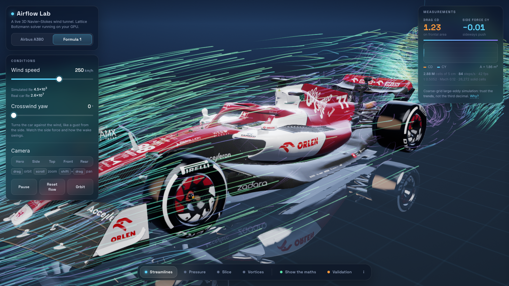
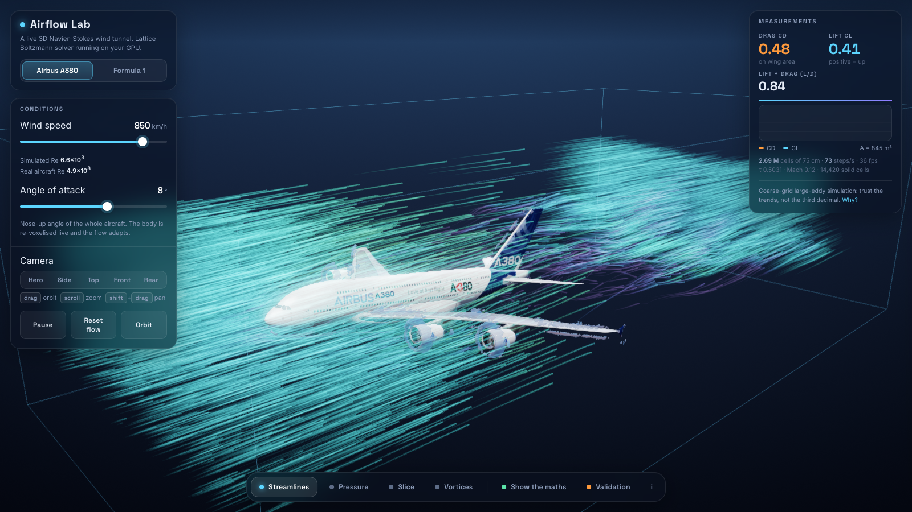
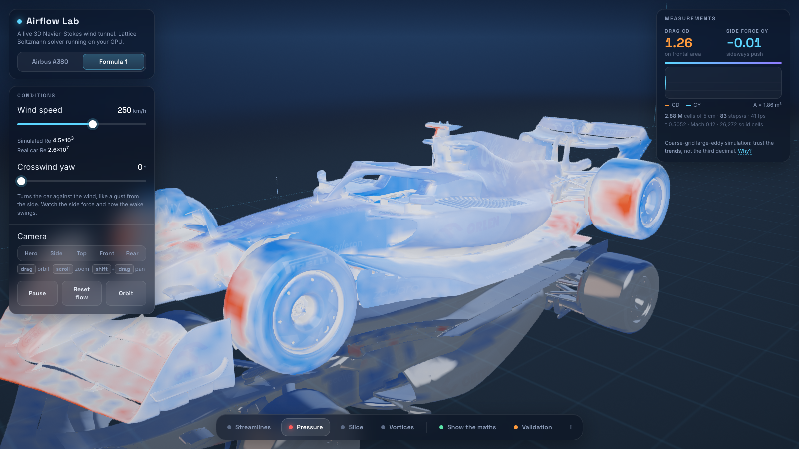

<div align="center">

# Airflow Lab

**A live 3D wind tunnel in your browser.**
Real Navier-Stokes fluid physics, solved on your GPU, around an Airbus A380 and a Formula 1 car.

[**Launch the live demo**](https://airflow-lab.vercel.app) &nbsp;·&nbsp; [How it works](EXPLAINER.md) &nbsp;·&nbsp; [Validation](#how-do-we-know-its-right)

  



</div>

> Needs a browser with **WebGPU**: Chrome or Edge on a laptop or desktop, or Safari 26+. Phones and very old GPUs are not supported (you get a friendly page explaining why).

## What is this?

Airflow Lab is a wind tunnel that runs entirely inside a web page. Nothing is pre-recorded and nothing is faked with a visual effect: every frame, a fluid solver updates about 2.8 million cells of air on your graphics card, and the picture you see is drawn from that live result.

You can spin the camera around a real A380 or F1 car model, change the wind speed, tilt the aircraft or yaw the car into a crosswind, and watch the airflow, pressure and vortices rearrange themselves. A panel next to the scene shows the actual equations behind what you are looking at, with live numbers from the running simulation.

It was built as an **IB Mathematics Exhibition** project, so the maths is meant to be visible and defensible, not hidden behind eye candy. That is why it ships with tests against exact solutions, an honest list of limitations, and a long explainer.

## What you can do

| | |
|---|---|
| **Orbit and zoom** | Drag to orbit, scroll to zoom, shift-drag to pan. Preset views: hero, side, top, front, rear. |
| **Wind speed** | Changes the Reynolds number of the simulation, the one dimensionless number that decides how a flow behaves. |
| **Angle of attack** (A380) | Tilts the whole aircraft. The body is re-voxelised on the GPU in real time and the flow adapts around it. |
| **Crosswind yaw** (F1) | Turns the car against the wind and shows the side force it feels. |
| **Streamlines** | Thousands of smoke particles carried through the live velocity field. Calm air is cool blue, accelerated air is warm. |
| **Pressure** | Surface pressure painted on the body: red where air slams in, blue where it is sucked away. |
| **Slice** | A movable plane through the flow coloured by speed or pressure, on any axis. |
| **Vortices** | 3D tubes of rotating air (the Q-criterion), e.g. the wake behind the wheels or the vortex off a wingtip. |
| **Show the maths** | Typeset equations from Navier-Stokes down to the collision step, with live values of τ, ν, Re and Mach. |
| **Validation** | The solver checked against exact solutions and a published experimental curve, re-runnable live on your GPU. |

Keyboard: <kbd>Space</kbd> pause · <kbd>1</kbd>-<kbd>4</kbd> layers · <kbd>M</kbd> maths · <kbd>V</kbd> validation.

<table>
<tr>
<td width="50%"></td>
<td width="50%"></td>
</tr>
<tr>
<td align="center"><sub>A380 at 8° angle of attack: streamlines and wake</sub></td>
<td align="center"><sub>F1 pressure: stagnation on tyres and front wing (red), suction (blue)</sub></td>
</tr>
</table>

## How it works, in one minute

Air obeys the **Navier-Stokes equations**. Nobody can solve them on paper for a car, so this project solves them numerically with the **lattice Boltzmann method**: instead of tracking velocity and pressure directly, it tracks how much fluid is moving in each of 19 directions at every cell of a 3D grid. Each time step is two simple moves, **stream** (fluid hops to the neighbouring cell) and **collide** (fluid relaxes toward equilibrium). A result called Chapman-Enskog shows that this reproduces Navier-Stokes exactly, with viscosity `ν = (τ − ½) / 3`.

Because every cell only talks to its neighbours, the method maps perfectly onto a GPU. The whole pipeline runs there:

```
 3D model ──► GPU voxeliser ──► solid/air grid ──► lattice Boltzmann ──► velocity, Cp, Q volumes ──► what you see
 (triangles)  (mark + flood     (which cells        solver, 19            (3D textures)              streamlines, pressure,
               fill)             are the body)       directions/cell                                   slice, vortex tubes
                                                          └──► momentum exchange ──► drag, lift, side force
```

- **Voxeliser:** each triangle marks the cells it touches, then a flood fill from outside marks everything not reachable as solid. This works on messy real-world meshes with holes.
- **Solver:** D3Q19 lattice, BGK collision with a **Smagorinsky** sub-grid turbulence model, half-way bounce-back walls, momentum-exchange forces.
- **Renderer:** raw WebGPU (no engine), HDR with bloom, glossy reflections, planar floor reflection, ray-marched vortex surfaces.

The full story, including a traced example request, why each design choice beat the alternatives, and the bugs found along the way, is in **[EXPLAINER.md](EXPLAINER.md)**.

## How do we know it's right?

A simulation is only worth trusting if it reproduces things we already know. These are measured results from the solver running on a real GPU, reported as they came out (`src/validation/validate.ts`):

| Test | Result |
|---|---|
| **Taylor-Green vortex** (exact decay rate, checks `ν = (τ−½)/3`) | 3.8567×10⁻³ vs 3.8553×10⁻³ exact, **0.04% error** |
| **Poiseuille channel flow** (exact parabola), τ = 1.0 | **0.03%** of peak velocity |
| **Poiseuille channel flow**, τ = 0.7 | **0.17%** of peak velocity |
| **Drag on a sphere** vs the experimental Schiller-Naumann curve, Re 10 to 200 | Solver reads **7.6% to 13.9% high**, shrinking as Re rises |

The sphere error is not hidden. At Re 50, moving the walls out to 8 diameters and the inlet to 8 diameters upstream cuts it from 12.3% to **7.5%**, so a good part of it is the test box being too tight; the rest is consistent with the staircase surface and the ±5% scatter of the correlation itself.

Sanity checks on the real models: the F1 car gives a drag coefficient of about 1.0 to 1.3 (real F1 cars are roughly 0.9 to 1.1), and the A380's lift rises steadily with angle of attack (CL = -0.03, 0.10, 0.26, 0.46 at 0°, 4°, 8°, 12°).

## Honest limitations

This is a real 3D solver, but it is **not wind-tunnel accurate**, and the app says so on screen. Read the trends, not the third decimal.

- **Reynolds number is thousands of times too low** (about 4.5×10³ simulated vs 3×10⁷ for a real F1 car). The grid (5 cm cells for the car, 75 cm for the A380) cannot resolve thin boundary layers, so small eddies are modelled, not resolved.
- **The F1 makes almost no downforce here.** Real downforce needs thin wings and a 4 cm floor gap working at Re ~10⁷. Here a wing is about six cells wide at a chord Reynolds number of a few hundred, so it stalls. This was tested at two resolutions (5 cm and 3.5 cm) with the same result, so it is a Reynolds-number limit, not a grid bug. That is why the car panel reports **drag and side force** and not downforce: a fake number would have been easy, and wrong.
- **A380 drag is about 15× too high** (Cd ≈ 0.46 vs ≈ 0.03) because the thin wings are only 1 to 2 cells thick. The lift *trend* with angle is right; absolute drag is not.
- The F1 floor is **free-slip** (a rolling road with its boundary layer removed). A moving belt over a one-cell gap pumped air into dead ends on a grid this coarse.
- The flow is **incompressible**: fine for a car, an approximation for an airliner at Mach 0.85.

## Run it yourself

```bash
git clone https://github.com/IsaacM2020/airflow-lab.git
cd airflow-lab
npm install
npm run dev          # open http://127.0.0.1:5180 in Chrome
```

On macOS you can also double-click `Airflow Lab.command`.

```bash
npm run build        # type-check + production build into dist/
node tools/run-validation.mjs taylor,poiseuille1,poiseuille2   # headless GPU validation (dev server running)
node tools/e2e.mjs                                              # drives the real UI end to end
```

Performance target: about 70 to 85 solver steps per second at roughly 40 fps on a recent Apple M-series GPU. The solver adapts how many physics steps it runs per frame to keep the camera smooth.

## Project layout

```
src/app/        frame loop, per-model presets, one running wind tunnel (solver + voxeliser + forces)
src/solver/     lbm.ts (the D3Q19 solver shaders), voxel.ts (GPU voxeliser), viz.ts (Cp / Q volumes)
src/render/     scene, streamlines, slice, vortex ray-marcher, bloom and tone mapping, camera
src/ui/         interface, the maths panel (KaTeX), validation view
src/validation/ the three benchmark tests, shared by the app and the headless runner
tools/          model baking, screenshot and test scripts
public/models/  the two baked 3D models and their textures
```

## Credits and licences

- **Code:** MIT, see [LICENSE](LICENSE).
- **Formula 1 car (Alfa Romeo C42):** [markste-in/c42](https://github.com/markste-in/c42), based on the model published by Alfa Romeo, **WTFPL**.
- **Airbus A380:** [flightradar24/fr24-3d-models](https://github.com/flightradar24/fr24-3d-models) (from the FlightGear aircraft library), **GPL-2.0**. The file was converted to a compact binary mesh and its parts merged; those files in [`public/models`](public/models) remain under GPL-2.0, see [`public/models/LICENSES.md`](public/models/LICENSES.md).
- **Equation typesetting:** [KaTeX](https://katex.org), MIT.
- Fluid method: lattice Boltzmann with BGK collision (Bhatnagar-Gross-Krook), Smagorinsky sub-grid model, D3Q19 lattice.
